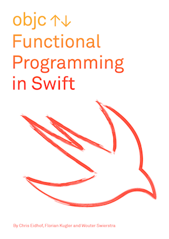

# Functional Programming in Swift (Beta)

Welcome to the early access repository of the "Functional Programming in Swift" book.

We will start adding preliminary content here starting early July!

We would love to hear from you. If there are any topics you'd like to see
included, or if there's anything that deserves a better explanation, let us
know. File an issue, or send an email to mail@objc.io 

Florian, Wouter and Chris
